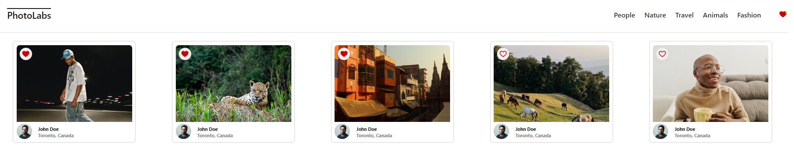

# PhotoLabs!

React-based single-page client side application that allows users to view photos in different contexts.

# Functional Requirements

- Application's data layer consists of `PostgreSQL` database
- The API server consists of a `Node Express.js` server application
- The client will communicate with the API over HTTP using the JSON format

# Behavioural Requirements

- A user can view photos from the homepage loaded from the API
- The user can navigate to different photo topics
- The user can click on a photo to view a larger version of the photo and relevant / similar photos
- The user can like a photo from anywhere within the application where the photo is displayed
- The user can view a heart icon with a notification in the navigation if there are liked photos
- The navigation will consist of different topics and heart icon
- The client-side application will make API requests to load and persist data (i.e. relevant data is not lost after a session restarts, so after a browser refresh)


# Technical Specifications

- Client application uses `Create React App (CRA) `
- Express is used for `API server application`
- Two different servers were used during development:
  - Client-side Webpack development server
  - API server to provide photo data

## Tech Stack

<p align="left">
  <a href="https://skillicons.dev">
    
  </a>
</p>

## Setup

Install dependencies with `npm install` in each respective `/frontend` and `/backend`.

## [Frontend] Running Webpack Development Server

```sh
cd frontend
npm start
```

## [Backend] Running Backend Servier

Read `backend/readme` for further setup details.

```sh
cd backend
npm start
```
## Application Screenshots

### PhotoLabs Home Page


### User can store one or many favourited photos globally and get notification alert in navigation bar




### User can preview larger image of clicked photo in modal view. The modal also reloads with new photo when user clicks on any similar / related picture. The favourite photos still stays stored across application


###  Modal also displays related / similar photos.


###  User can click on certain topic from navigation bar and app page loads with same category photos list. In example below photos against 'Nature' topic are displayed


## Thankyou!

Thank you for your time. If interested check my profile and connect with me at [LinkedIn](https://www.linkedin.com/in/madiha-waqar-a8253827).